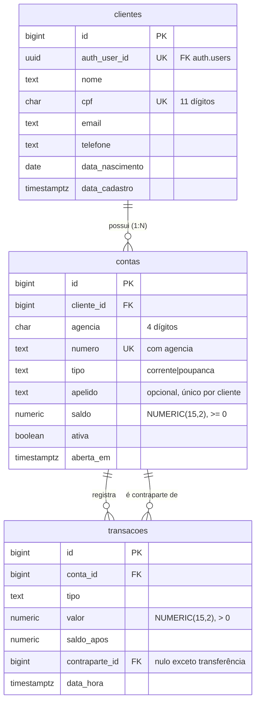

> [Índice](README.md) · **02 — Modelo de dados**

# Modelo de dados

Três tabelas. Um cliente tem **N contas**; uma conta tem N transações. As
restrições que o plano original deixava de fora estão marcadas na seção
[Diferenças](#diferenças-em-relação-ao-plano-original).



## DDL

Arquivo: `supabase/migrations/20260826120000_schema_inicial.sql`

> **Emenda aplicada na F1.** `auth_user_id` guarda a identidade mas **não** tem
> foreign key para `auth.users` nesta fase. A tabela do GoTrue só ganha seu
> formato final quando o serviço de autenticação roda as próprias migrações —
> amarrar a persistência a isso tornaria a Fase 1 impossível de testar sem a
> stack de auth no ar. A constraint entra na
> [Fase 3](fase-3-autenticacao.md), junto com o resto da autenticação.

```sql
-- ---------- clientes ----------
create table clientes (
  id              bigint generated always as identity primary key,
  auth_user_id    uuid not null unique,   -- FK para auth.users entra na Fase 3
  nome            text not null check (length(trim(nome)) > 0),
  cpf             char(11) not null unique check (cpf ~ '^[0-9]{11}$'),
  email           text not null,
  telefone        text not null check (telefone ~ '^[0-9]{10,11}$'),
  data_nascimento date not null check (data_nascimento <= current_date),
  data_cadastro   timestamptz not null default now()
);

-- ---------- numeração de contas ----------
create sequence contas_numero_seq start 100001;

create or replace function gerar_numero_conta() returns text
language sql volatile as $$
  select lpad(nextval('contas_numero_seq')::text, 8, '0');
$$;

-- ---------- contas ----------
create table contas (
  id         bigint generated always as identity primary key,
  cliente_id bigint not null references clientes(id) on delete restrict,
  agencia    char(4) not null default '0001' check (agencia ~ '^[0-9]{4}$'),
  numero     text    not null default gerar_numero_conta(),
  tipo       text    not null check (tipo in ('corrente','poupanca')),
  apelido    text    check (apelido is null or length(trim(apelido)) > 0),
  saldo      numeric(15,2) not null default 0 check (saldo >= 0),
  ativa      boolean not null default true,
  aberta_em  timestamptz not null default now(),

  unique (agencia, numero)
);

-- apelido é único dentro do cliente, quando informado
create unique index contas_apelido_idx
    on contas (cliente_id, lower(apelido))
 where apelido is not null;

create index contas_cliente_idx on contas (cliente_id) where ativa;

-- ---------- transacoes ----------
create table transacoes (
  id             bigint generated always as identity primary key,
  conta_id       bigint not null references contas(id) on delete restrict,
  tipo           text not null check (tipo in
                   ('deposito','saque','transferencia_saida','transferencia_entrada')),
  valor          numeric(15,2) not null check (valor > 0),
  saldo_apos     numeric(15,2) not null check (saldo_apos >= 0),
  contraparte_id bigint references contas(id),
  data_hora      timestamptz not null default now(),

  -- contraparte existe se e somente se for transferência
  constraint contraparte_coerente check (
    (tipo in ('transferencia_saida','transferencia_entrada')) = (contraparte_id is not null)
  )
);

create index transacoes_extrato_idx on transacoes (conta_id, data_hora desc, id desc);
```

## Funções de movimentação

Arquivo: `supabase/migrations/0002_funcoes_movimentacao.sql`

Estas funções são o cumprimento de [DT-02](01-decisoes-tecnicas.md#dt-02).
Cada uma atualiza o saldo e insere no ledger na **mesma transação**.

### Depósito

```sql
create or replace function realizar_deposito(p_conta_id bigint, p_valor numeric)
returns numeric language plpgsql as $$
declare v_saldo numeric(15,2);
begin
  if p_valor <= 0 then raise exception 'VALOR_INVALIDO'; end if;

  update contas set saldo = saldo + p_valor
   where id = p_conta_id and ativa
   returning saldo into v_saldo;
  if not found then raise exception 'CONTA_NAO_ENCONTRADA'; end if;

  insert into transacoes (conta_id, tipo, valor, saldo_apos)
  values (p_conta_id, 'deposito', p_valor, v_saldo);

  return v_saldo;
end; $$;
```

### Saque

```sql
create or replace function realizar_saque(p_conta_id bigint, p_valor numeric)
returns numeric language plpgsql as $$
declare v_saldo numeric(15,2);
begin
  if p_valor <= 0 then raise exception 'VALOR_INVALIDO'; end if;

  -- a verificação de saldo é a própria cláusula where: não há janela entre
  -- checar e escrever
  update contas set saldo = saldo - p_valor
   where id = p_conta_id and ativa and saldo >= p_valor
   returning saldo into v_saldo;

  if not found then
    if exists (select 1 from contas where id = p_conta_id and ativa)
      then raise exception 'SALDO_INSUFICIENTE';
      else raise exception 'CONTA_NAO_ENCONTRADA';
    end if;
  end if;

  insert into transacoes (conta_id, tipo, valor, saldo_apos)
  values (p_conta_id, 'saque', p_valor, v_saldo);

  return v_saldo;
end; $$;
```

### Transferência

Com várias contas por cliente, a transferência **entre contas do próprio
titular** passa a ser o caso mais frequente. A ordem de lock evita deadlock
quando duas transferências cruzadas acontecem ao mesmo tempo.

```sql
create or replace function transferir(p_origem bigint, p_destino bigint, p_valor numeric)
returns numeric language plpgsql as $$
declare
  v_saldo_origem  numeric(15,2);
  v_saldo_destino numeric(15,2);
begin
  if p_valor <= 0         then raise exception 'VALOR_INVALIDO'; end if;
  if p_origem = p_destino then raise exception 'CONTAS_IGUAIS';  end if;

  -- lock em ordem crescente de id: A→B e B→A não travam uma na outra
  perform id from contas
   where id in (p_origem, p_destino)
   order by id
     for update;

  update contas set saldo = saldo - p_valor
   where id = p_origem and ativa and saldo >= p_valor
   returning saldo into v_saldo_origem;
  if not found then raise exception 'SALDO_INSUFICIENTE'; end if;

  update contas set saldo = saldo + p_valor
   where id = p_destino and ativa
   returning saldo into v_saldo_destino;
  if not found then raise exception 'CONTA_NAO_ENCONTRADA'; end if;

  insert into transacoes (conta_id, tipo, valor, saldo_apos, contraparte_id)
  values (p_origem,  'transferencia_saida',   p_valor, v_saldo_origem,  p_destino),
         (p_destino, 'transferencia_entrada', p_valor, v_saldo_destino, p_origem);

  return v_saldo_origem;
end; $$;
```

### Encerramento de conta

```sql
create or replace function encerrar_conta(p_conta_id bigint)
returns void language plpgsql as $$
begin
  update contas set ativa = false
   where id = p_conta_id and ativa and saldo = 0;
  if not found then raise exception 'CONTA_NAO_ENCERRAVEL'; end if;
end; $$;
```

A conta é desativada, nunca removida — o ledger precisa continuar íntegro. Por
isso as FKs usam `on delete restrict`.

## Reconciliação

Esta query deve retornar **zero linhas**. É o teste de integridade do sistema
inteiro ([CA-02](00-visao-e-escopo.md#critérios-de-aceite-globais)) e roda ao
final de cada suíte de testes de integração.

```sql
select c.id, c.numero, c.saldo, l.saldo_ledger
  from contas c
  left join lateral (
       select coalesce(sum(
                case when t.tipo in ('deposito','transferencia_entrada')
                     then t.valor else -t.valor end), 0) as saldo_ledger
         from transacoes t
        where t.conta_id = c.id
  ) l on true
 where c.saldo is distinct from l.saldo_ledger;
```

## Diferenças em relação ao plano original

| Mudança | Motivo |
| --- | --- |
| `valor` deixa de ser `float` | [DT-01](01-decisoes-tecnicas.md#dt-01) — precisão monetária |
| `clientes` recupera `email`, `telefone`, `data_nascimento` | A modelagem anterior descartava dados que a classe `Cliente` já valida |
| `unique (agencia, numero)` | Nada impedia duas contas com o mesmo número |
| `transacoes.saldo_apos` | Torna o extrato reconstruível sem recalcular a série |
| `transacoes.contraparte_id` | Rastreia a transferência nas duas pontas |
| `contas.tipo` e `contas.apelido` | Necessários para distinguir as N contas de um mesmo cliente |
| `contas.ativa` | Encerramento sem apagar histórico |
| `check (cpf ~ '^[0-9]{11}$')` | `unique` impede duplicata, não impede lixo |
| `constraint contraparte_coerente` | Impede transferência órfã e depósito com contraparte |
